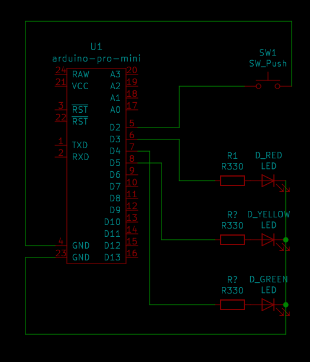

Лабораторная работа 2
=====================

Чтобы выбрать задание нужно изменить `static int taskNo` на номер задания, 
собрать и прошить. Схема подключения:

Задание 1.
----------
При нажатии кнопки включается и мигает каждые 500 мс светодиод на пятом пине.
При отжатой кнопке сначала включается и затем гаснет светодиод на третьем пине,
затем через 500 мс включается и гаснет светодиод на четвёртом пине.
И с паузой в 500 мс схема горении светодиодов повторятся до тех пор,
пока кнопка остаётся отжатой.

Задание 2. 
При нажатии кнопки поочередно включаются красный, зеленый, желтый светодиоды с паузой в секунду.
При отключении кнопки светодиоды гаснут в таком-же порядке с паузой в секунду.

Задание 3.
----------

Если нажата кнопка, то каждые полсекунды поочередно включаются 3 (красный) и 5 (желтый) светодиод.
4 (зеленый) не включается.
Если кнопка не нажата, то каждые 250 мс. Мигает 4 светодиод. 3 и 5 не включаются.

Задание 4.
----------

Если кнопка нажата, то все светодиоды будут выключены.
Если не нажата, то все светодиоды будут вместе каждые 500 мс мигать.

Задание 5.
----------

Если кнопка нажата, то горят красный, зеленый и желтый вместе.
Если кнопку отжать, то 2 раза повторяется цикл: горит красный, пауза в 1 с, горит зеленый,
пауза в 1 с, горит желтый, пауза в 1 с и т.д.

Задание 6 (Индивидуальное), вариант 5.
--------------------------------------

Первый этап. Последовательное горение лампочек:
кр(1 с) -> пауза (1 с) -> кр (1 с) -> пауза (1 с) -> з (1 с) -> пауза (1 с) -> ж (1 с)
Повторение: 5 раз
Второй этап. Одновременное зажигание и мигание двух лампочек –
красной и жёлтой - с частотой мигания 2 раза в 1 секунду.
Миганий – всего – 12 раз.
Третий этап. Мигание лампочек по две – по три в цикле:
[2с (Кр+з)+2с (пауза)+2с (кр+з+ж)+2с (пауза)]

10 миганий [*] по 8 секунд